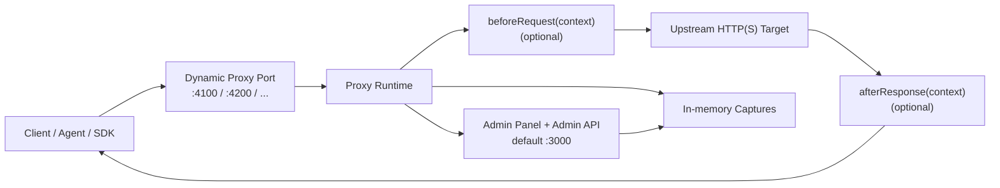

<div align="center">
  <h1>ProxyObserver</h1>
  <p>
    <strong>面向可观测性与调试的轻量级透明反向代理。</strong>
  </p>
  <p>
    用来观察 agent、SDK、CLI 工具与 LLM 服务之间的真实 HTTP 请求与响应，
    支持运行时动态端口映射、内存抓包与可选的请求/响应脚本钩子。
  </p>
  <p>
    <a href="https://github.com/NexusAgentX/ProxyObserver">Repository</a>
    ·
    <a href="#quick-start">Quick Start</a>
    ·
    <a href="#script-hooks">Script Hooks</a>
    ·
    <a href="#admin-api">Admin API</a>
  </p>
  <p>
    
    
    
    
    
    
  </p>
</div>

## Overview

`ProxyObserver` 是一个单进程、零数据库、面向临时排查的 HTTP(S) 反向代理观察工具。

它适合这样的场景：

- 想确认某个 agent、CLI、SDK 到底发了什么请求
- 想直接查看 headers、query、body、响应状态与响应体
- 想在本机快速把 `:4100` 转发到某个上游 API，并且随时改规则
- 想在不引入数据库、认证系统、证书中间人代理的前提下做临时研究
- 想在转发链路上插入一点 JS 逻辑，改写请求或响应

> [!NOTE]
> 这是一个面向调试与研究的透明反向代理，不是通用浏览器抓包代理，也不是 CONNECT 隧道 / HTTPS MITM 工具。

## Why ProxyObserver

| Capability | What it gives you |
| --- | --- |
| Dynamic port mapping | 在管理面板里实时新增、更新、关闭代理监听端口，无需重启整个服务 |
| In-memory captures | 请求与响应细节只保存在内存，排查快、退出即清空 |
| Transparent forwarding | 方法、路径、查询参数、请求头、请求体与上游响应尽量保持原样 |
| Script hooks | 通过 `beforeRequest(context)` / `afterResponse(context)` 插入自定义逻辑 |
| Single-process deployment | 管理面板与所有动态监听器都跑在同一个 Bun 进程里 |
| Single binary path | 可以编译成一个可执行文件，便于在本机或临时环境直接分发 |

## How It Works



## Highlights

- 管理面板固定运行在一个端口上，默认 `http://127.0.0.1:3000`
- 代理监听端口在运行时动态创建，每个端口对应一个上游 `http(s)` target
- 面板里可以查看原始请求、转发后的请求、上游响应、最终响应
- 响应头、响应体、状态码、耗时和脚本执行状态都会被记录
- 代理抓包默认只保留最近一批请求，数量可通过环境变量调整
- `bun run compile` 可生成单文件可执行程序

## Quick Start

### Requirements

- [Bun](https://bun.sh/) runtime

### 1. Install dependencies

```bash
bun install
```

### 2. Start the app

开发模式：

```bash
bun dev
```

生产模式：

```bash
bun start
```

默认管理面板地址：

```text
http://127.0.0.1:3000
```

### 3. Create a proxy rule

在管理面板里填写：

- `Port`: 例如 `4100`
- `Target`: 例如 `https://api.example.com`
- `Dynamic JS Script`: 可留空，表示纯转发

保存后，访问：

```text
http://127.0.0.1:4100/anything?debug=1
```

实际会被转发到：

```text
https://api.example.com/anything?debug=1
```

### 4. Inspect traffic

打开控制台右侧的 Inspector，可以查看：

- Incoming Request
- Forwarded Request
- Upstream Response
- Final Response
- Request / Response Body
- Script hook 是否定义、是否生效、是否报错

## Commands

```bash
# development
bun dev

# production
bun start

# build frontend assets into dist/
bun run build

# compile a single executable to dist/proxyobserver
bun run compile

# type-check
bun run typecheck

# lint the current commit message file
bun run commitlint
```

## Versioning And Releases

这个仓库已经配置好了现代化的 GitHub 自动发版链路：

- `CI` workflow 会在 PR 和 `main` 分支上执行安装、类型检查、前端构建和可执行文件编译
- `Release` workflow 会根据合并到 `main` 的 Conventional Commits 自动维护 release PR
- `bun install` 后会自动启用本地 Git hooks，提前在提交前挡住明显问题
- release PR 合并后，会自动更新 `package.json` 版本号与 [CHANGELOG.md](/Users/laysath/proj/ProxyObserver/CHANGELOG.md)
- GitHub Release 创建后，同一个 workflow 会自动构建并上传多平台二进制资产与 `checksums.txt`
- release 资产会附带 GitHub artifact attestation，便于后续做来源校验

### Commit format

为了让自动版本管理稳定工作，建议使用 Conventional Commits：

- `feat: add response diff inspector`
- `fix(proxy): preserve upstream headers`
- `docs: refresh setup guide`
- `refactor(runtime): simplify capture snapshots`

如果你使用 squash merge，PR 标题最好也遵循同样格式，因为默认 squash commit message 会直接采用 PR 标题。

### Local Git hooks

仓库使用 Husky 自动安装本地 Git hooks。执行一次 `bun install` 后，会自动启用：

- `commit-msg`: 用 `commitlint` 校验提交信息是否符合 Conventional Commits
- `pre-commit`: 运行 `bun run typecheck`
- `pre-push`: 运行 `bun run build`

如果你在特殊场景下需要临时跳过本地钩子，可以显式设置 `HUSKY=0`，但 CI 和 GitHub 上的 release 流程仍然会继续检查。

### Release flow

1. 提交 PR，使用 Conventional Commit 风格的提交信息或 PR 标题
2. 合并到 `main`
3. `Release` workflow 自动创建或更新 release PR
4. 合并 release PR
5. GitHub 自动生成 tag 与 Release
6. 同一个 `Release` workflow 自动附加以下产物：

- `proxyobserver-linux-x64.tar.gz`
- `proxyobserver-macos-x64.tar.gz`
- `proxyobserver-macos-arm64.tar.gz`
- `proxyobserver-windows-x64.zip`
- 每个资产对应的 `.sha256`
- 汇总的 `checksums.txt`

## Script Hooks

每条代理规则都可以配置一段 JS，定义以下任一函数：

- `beforeRequest(context)`
- `afterResponse(context)`

两者都定义也可以。

### Hook examples

```js
async function beforeRequest(context) {
  const url = new URL(context.url);
  url.searchParams.set("debug", "1");

  context.url = url.toString();
  context.headers["x-proxy-observer"] = "before-request";
  return context;
}

async function afterResponse(context) {
  context.headers["x-proxy-observer-response"] = "after-response";
  return context;
}
```

### Request context

```ts
interface RequestScriptContext {
  url: string;
  method: string;
  headers: Record<string, string>;
  body: {
    text: string | null;
    base64: string | null;
    contentType: string | null;
  } | null;
}
```

### Response context

```ts
interface ResponseScriptContext {
  requestUrl: string;
  requestMethod: string;
  status: number;
  statusText: string;
  headers: Record<string, string>;
  body: {
    text: string | null;
    base64: string | null;
    contentType: string | null;
  } | null;
}
```

### Script runtime notes

- 脚本运行在同一个 Bun 进程内，但会屏蔽 `Bun`、`process`、`require`、`fetch`、`WebSocket` 等全局对象
- 允许使用 `console`、`URL`、`TextEncoder`、`TextDecoder`、`atob`、`btoa`
- 脚本必须至少定义一个 hook，否则规则保存会失败
- 脚本异常会让该请求返回 `500`，并在抓包详情里留下错误记录

> [!IMPORTANT]
> 纯转发场景下，流式响应可以保持透传。
> 但只要启用了 `afterResponse(context)`，当前实现就会先把上游响应完整读入内存，再执行脚本并一次性返回给客户端。
> 这意味着该规则下的真正实时流式响应会退化为缓冲后返回。

## Environment Variables

| Variable | Default | Description |
| --- | --- | --- |
| `ADMIN_PORT` | `3000` | 管理面板与管理 API 端口 |
| `PORT` | `3000` | `ADMIN_PORT` 未设置时的兼容回退值 |
| `LISTEN_HOST` | `127.0.0.1` | 所有服务绑定的主机地址 |
| `CAPTURE_LIMIT` | `200` | 内存中最多保留多少条抓包记录 |

示例：

```bash
ADMIN_PORT=3001 LISTEN_HOST=127.0.0.1 CAPTURE_LIMIT=500 bun dev
```

## Admin API

| Method | Path | Description |
| --- | --- | --- |
| `GET` | `/api/health` | 健康检查与基本状态 |
| `GET` | `/api/admin/overview` | 拉取 dashboard 总览数据 |
| `GET` | `/api/admin/listeners` | 列出当前所有代理规则 |
| `POST` | `/api/admin/listeners` | 新增或更新一个监听规则 |
| `DELETE` | `/api/admin/listeners/:port` | 关闭指定端口监听 |
| `GET` | `/api/admin/captures` | 列出抓包摘要 |
| `GET` | `/api/admin/captures/:id` | 获取单条抓包详情 |
| `DELETE` | `/api/admin/captures` | 清空所有抓包记录 |

创建或更新规则示例：

```bash
curl -X POST http://127.0.0.1:3000/api/admin/listeners \
  -H "content-type: application/json" \
  -d '{
    "port": 4100,
    "target": "https://api.example.com",
    "script": ""
  }'
```

## Use Cases

- 调试本地 agent 工具调用 LLM 时到底发了哪些 HTTP 请求
- 对接第三方 API 时排查 header、body、query 是否符合预期
- 快速对同一个上游目标挂多个观察端口，比较不同客户端行为
- 在代理层注入轻量调试逻辑，而不是改动调用方源码
- 临时复现和研究流式响应、压缩响应、请求重写、响应改写等场景

## Trade-offs And Boundaries

- 当前是 HTTP(S) 反向代理，不是通用 CONNECT 隧道代理
- 抓包只保存在内存中，进程退出后历史会丢失
- 默认绑定 `127.0.0.1`，更适合本机调试；若需局域网访问请显式调整 `LISTEN_HOST`
- 关闭了自动解压，以尽量保留上游响应原貌
- 启用 `afterResponse` 时会缓冲整个响应体，因此不适合真正无限流或长连接 SSE 场景
- 没有内置认证、用户系统或持久化存储，定位就是临时调试工具

## Project Structure

<details>
<summary>Open structure</summary>

```text
src/
├── index.ts        # 管理端 Bun 服务入口
├── runtime.ts      # 动态监听端口、转发、抓包与脚本运行时
├── config.ts       # 环境变量配置
├── frontend.tsx    # React 前端入口
├── App.tsx         # 管理面板 UI
├── siteData.ts     # 文案与默认值
├── types.ts        # 前后端共享类型
├── index.html      # HTML 入口
└── index.css       # 页面样式
```

</details>

## Development Notes

- 管理面板与动态代理监听器都由同一个 Bun 进程托管
- 每个监听端口的规则都存活在内存中，更新规则时会重建该端口监听器
- 请求详情与响应详情按最近记录保存在内存数组中，并按 `CAPTURE_LIMIT` 截断

## License

[MIT](./LICENSE) © 2026 [NexusAgentX](https://github.com/NexusAgentX)
